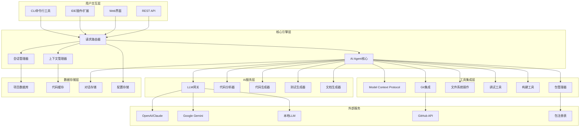
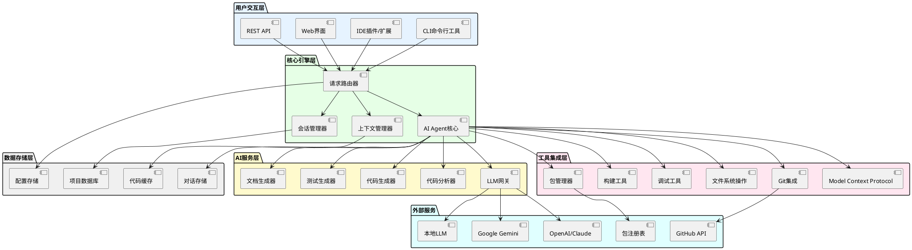
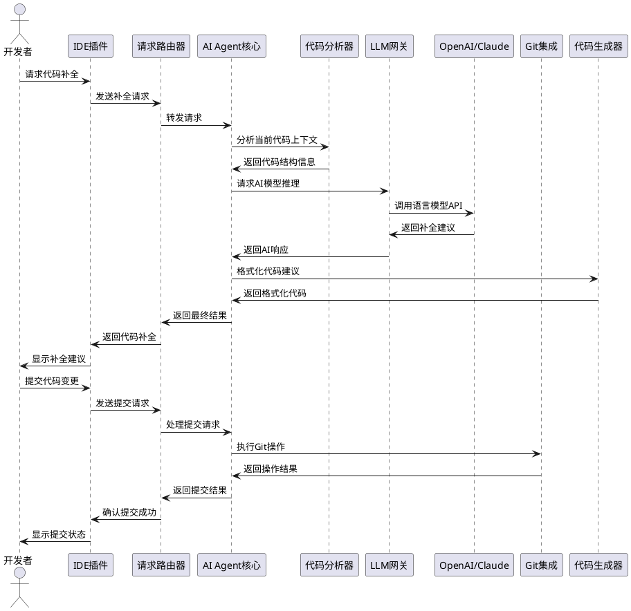
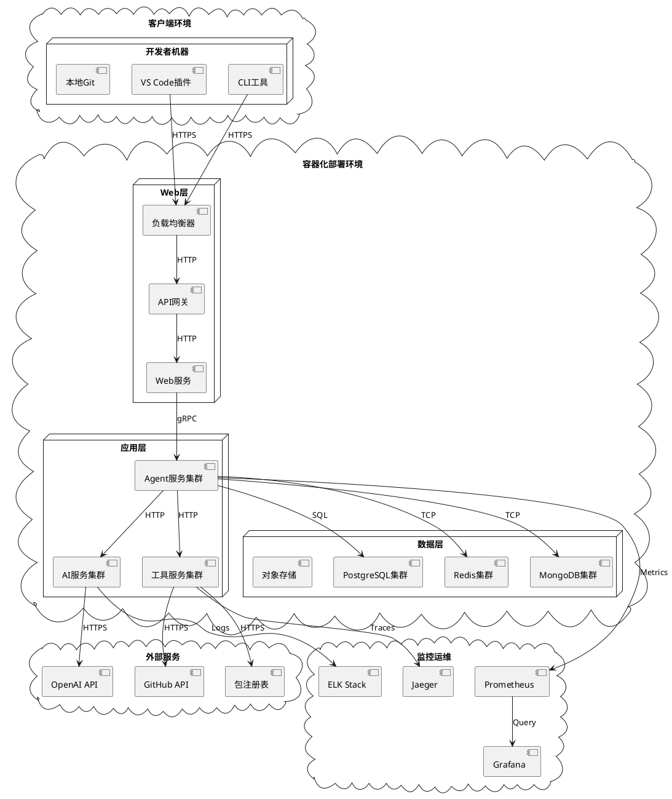

# AI编程工具架构图 - PlantUML版本

## Mermaid格式



## PlantUML格式



## C4架构图格式 (PlantUML C4扩展)

```plantuml
@startuml
!include https://raw.githubusercontent.com/plantuml-stdlib/C4-PlantUML/master/C4_Container.puml

title AI编程工具系统架构图

Person(user, "开发者", "使用AI编程工具进行开发")

System_Boundary(ai_coding_system, "AI编程工具系统") {
    Container_Boundary(ui_layer, "用户交互层") {
        Container(cli, "CLI工具", "命令行", "命令行交互界面")
        Container(ide_plugin, "IDE插件", "VS Code/JetBrains", "编辑器集成插件")
        Container(web_ui, "Web界面", "React/Vue", "浏览器端界面")
        Container(rest_api, "REST API", "HTTP/JSON", "第三方集成接口")
    }
    
    Container_Boundary(core_layer, "核心引擎层") {
        Container(router, "请求路由器", "Go/Node.js", "请求分发与路由")
        Container(session_mgr, "会话管理器", "Redis/Memory", "用户会话状态管理")
        Container(context_mgr, "上下文管理器", "Vector DB", "代码上下文处理")
        Container(agent_core, "AI Agent核心", "Python/Go", "智能代理控制器")
    }
    
    Container_Boundary(ai_layer, "AI服务层") {
        Container(llm_gateway, "LLM网关", "Python", "大语言模型接入")
        Container(code_analyzer, "代码分析器", "Tree-sitter", "代码结构分析")
        Container(code_generator, "代码生成器", "Template Engine", "智能代码生成")
        Container(test_generator, "测试生成器", "Jest/PyTest", "测试代码生成")
        Container(doc_generator, "文档生成器", "Markdown", "文档自动生成")
    }
    
    Container_Boundary(tool_layer, "工具集成层") {
        Container(mcp, "MCP协议", "JSON-RPC", "模型上下文协议")
        Container(git_integration, "Git集成", "Git CLI", "版本控制集成")
        Container(file_system, "文件系统", "OS API", "文件操作")
        Container(debug_tool, "调试工具", "DAP", "调试功能集成")
        Container(build_tool, "构建工具", "Make/Gradle", "项目构建")
        Container(package_mgr, "包管理器", "npm/pip", "依赖管理")
    }
    
    Container_Boundary(storage_layer, "数据存储层") {
        ContainerDb(project_db, "项目数据库", "PostgreSQL", "项目元数据")
        ContainerDb(code_cache, "代码缓存", "Redis", "代码分析缓存")
        ContainerDb(conversation_store, "对话存储", "MongoDB", "用户对话历史")
        ContainerDb(config_store, "配置存储", "JSON/YAML", "系统配置")
    }
}

System_Boundary(external_systems, "外部服务") {
    System_Ext(openai, "OpenAI/Claude", "大语言模型API")
    System_Ext(gemini, "Google Gemini", "Google AI模型")
    System_Ext(local_llm, "本地LLM", "自部署模型")
    System_Ext(github, "GitHub API", "代码仓库服务")
    System_Ext(registry, "包注册表", "npm/PyPI等")
}

' 关系连接
Rel(user, cli, "使用")
Rel(user, ide_plugin, "使用")
Rel(user, web_ui, "使用")

Rel(cli, router, "HTTP/gRPC")
Rel(ide_plugin, router, "HTTP/gRPC")
Rel(web_ui, router, "HTTP/REST")
Rel(rest_api, router, "HTTP/REST")

Rel(router, session_mgr, "管理会话")
Rel(router, context_mgr, "获取上下文")
Rel(router, agent_core, "转发请求")

Rel(agent_core, llm_gateway, "调用AI服务")
Rel(agent_core, code_analyzer, "分析代码")
Rel(agent_core, code_generator, "生成代码")
Rel(agent_core, test_generator, "生成测试")
Rel(agent_core, doc_generator, "生成文档")

Rel(llm_gateway, openai, "API调用")
Rel(llm_gateway, gemini, "API调用")
Rel(llm_gateway, local_llm, "本地调用")

Rel(agent_core, mcp, "协议通信")
Rel(agent_core, git_integration, "Git操作")
Rel(agent_core, file_system, "文件操作")
Rel(agent_core, debug_tool, "调试功能")
Rel(agent_core, build_tool, "构建项目")
Rel(agent_core, package_mgr, "包管理")

Rel(git_integration, github, "API调用")
Rel(package_mgr, registry, "包查询")

Rel(session_mgr, project_db, "存储/读取")
Rel(context_mgr, code_cache, "缓存/读取")
Rel(agent_core, conversation_store, "存储对话")
Rel(router, config_store, "读取配置")

@enduml
```

## 系统交互时序图



## 部署架构图


```

这份文档包含了四种不同格式的架构图：

1. **Mermaid格式** - 适用于GitHub、GitLab等平台的README文档
2. **标准PlantUML格式** - 经典的PlantUML语法，可以在各种支持PlantUML的工具中使用
3. **C4架构图格式** - 使用C4模型的PlantUML扩展，更适合展示系统架构
4. **时序图和部署图** - 补充的交互流程和部署架构图

每种格式都有其适用场景，你可以根据需要选择使用。所有图表都可以直接在支持相应格式的Markdown环境中渲染显示。